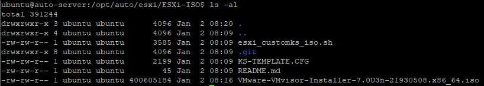

# Custom VMware ESXi ISO for automated installation

This script help you can custom ESXi ISO:

Clone this repo & upload ESXi ISO which you want to custom:

> git clone https://github.com/hhai-le/ESXi-ISO.git
> cd ESXi-ISO
> chmod +x esxi_customks_iso.sh

## example

> sudo ./esxi_customks_iso.sh --iso VMware-VMvisor-Installer-7.0U2-17630552.x86_64.iso \
> --ks KS-TEMPLATE.CFG \
> --ip-address 192.168.0.10 \
> --netmask 255.255.255.0 \
> --gateway 192.168.0.1 \
> --hostname esx1.aplnetworks.lab \
> --vlan 0 \
> --dns 172.16.11.5

